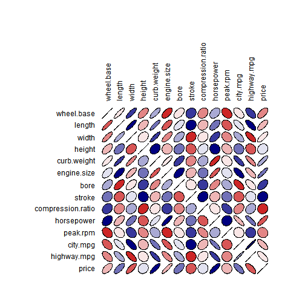
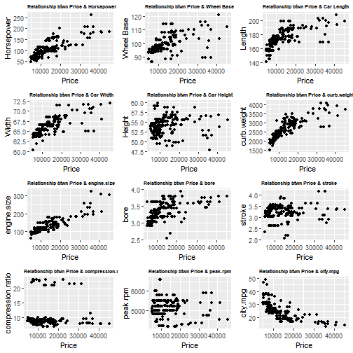
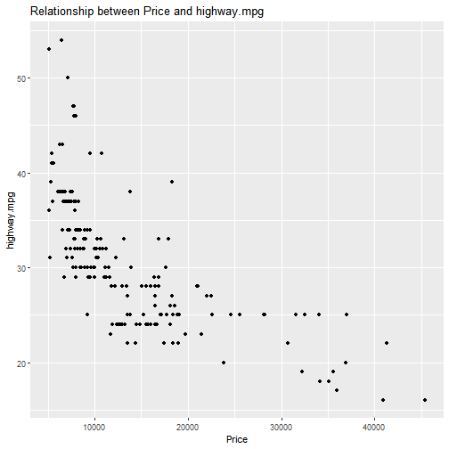
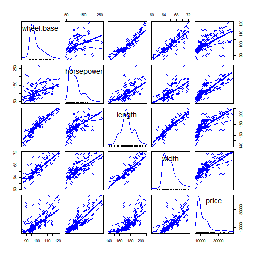
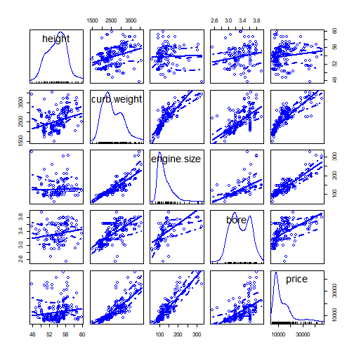
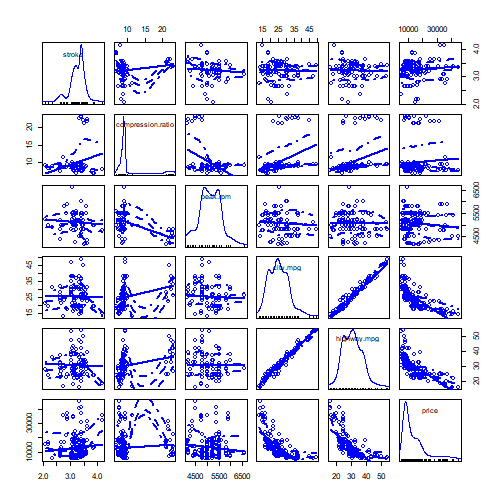
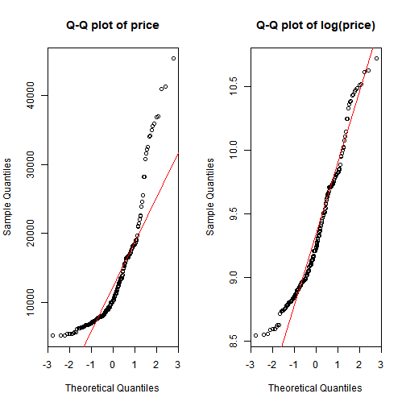
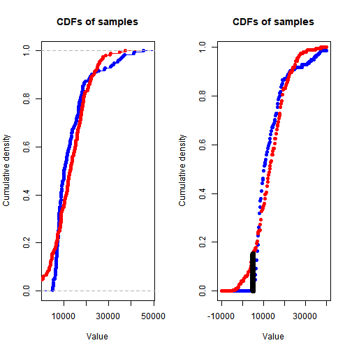

Sayam Khatri
========================================================
Exploratory Analysis and Regression - Automobile Data


About the data set
===========================================================
This data set is from the Univerisity of California Irvine Machine Learning Repository The data was compiled by Jeffrey C. Schlimmer from the following sources:

1985 Model Import Car and Truck Specifications, 1985 Ward's Automotive Yearbook.
Personal Auto Manuals, Insurance Services Office, 160 Water Street, New York, NY 10038
Insurance Collision Report, Insurance Institute for Highway Safety, Watergate 600, Washington, DC 20037


===================================================

This data set consists of three types of entities:

1. The specification of an auto in terms of various characteristics

2. Tts assigned insurance risk rating. This corresponds to the degree to which the auto is more risky than its price indicates. Cars are initially assigned a risk factor symbol associated with its price. Then, if it is more risky (or less), this symbol is adjusted by moving it up (or down) the scale. Actuaries call this process "symboling".

3. Its normalized losses in use as compared to other cars. This is the relative average loss payment per insured vehicle year. This value is normalized for all autos within a particular size classification (two-door small, station wagons, sports/speciality, etc...), and represents the average loss per car per year.


Objective
====================================================

The aim here is to explore the data set and find basic relationships of different features with an automobile's price. We will be starting with some brief exploratory analysis involving summary statistics and graphical visualization. We will also be conducting a few tests of hypotheses on the study variable price. We also want to see if there is a way to predict the price of the automobiles given all the information we have. We will be comparing a few different regression models to find the best one.


Let's get started.The function shown in the cell below loads the data from the .csv file. Some minimal clean up is performed on the data.
========================================================


```r
read.auto <- function(file ='./Automobile_data.csv')
{
  
  auto.price <- read.csv(file, header = TRUE, stringsAsFactors = FALSE)
  numcols <- c('price', 'bore', 'stroke', 'horsepower', 'peak.rpm')
  auto.price[, numcols] <- lapply(auto.price[, numcols], as.numeric)
  auto.price[complete.cases(auto.price), ]
}
auto.data <- read.auto()
```

Showing Data.The dataset has 195 observations with 26 different variables.
========================================================


```r
str(auto.data)
```

```
'data.frame':	195 obs. of  26 variables:
 $ symboling        : int  3 3 1 2 2 2 1 1 1 2 ...
 $ normalized.losses: chr  "?" "?" "?" "164" ...
 $ make             : chr  "alfa-romero" "alfa-romero" "alfa-romero" "audi" ...
 $ fuel.type        : chr  "gas" "gas" "gas" "gas" ...
 $ aspiration       : chr  "std" "std" "std" "std" ...
 $ num.of.doors     : chr  "two" "two" "two" "four" ...
 $ body.style       : chr  "convertible" "convertible" "hatchback" "sedan" ...
 $ drive.wheels     : chr  "rwd" "rwd" "rwd" "fwd" ...
 $ engine.location  : chr  "front" "front" "front" "front" ...
 $ wheel.base       : num  88.6 88.6 94.5 99.8 99.4 ...
 $ length           : num  169 169 171 177 177 ...
 $ width            : num  64.1 64.1 65.5 66.2 66.4 66.3 71.4 71.4 71.4 64.8 ...
 $ height           : num  48.8 48.8 52.4 54.3 54.3 53.1 55.7 55.7 55.9 54.3 ...
 $ curb.weight      : int  2548 2548 2823 2337 2824 2507 2844 2954 3086 2395 ...
 $ engine.type      : chr  "dohc" "dohc" "ohcv" "ohc" ...
 $ num.of.cylinders : chr  "four" "four" "six" "four" ...
 $ engine.size      : int  130 130 152 109 136 136 136 136 131 108 ...
 $ fuel.system      : chr  "mpfi" "mpfi" "mpfi" "mpfi" ...
 $ bore             : num  3.47 3.47 2.68 3.19 3.19 3.19 3.19 3.19 3.13 3.5 ...
 $ stroke           : num  2.68 2.68 3.47 3.4 3.4 3.4 3.4 3.4 3.4 2.8 ...
 $ compression.ratio: num  9 9 9 10 8 8.5 8.5 8.5 8.3 8.8 ...
 $ horsepower       : num  111 111 154 102 115 110 110 110 140 101 ...
 $ peak.rpm         : num  5000 5000 5000 5500 5500 5500 5500 5500 5500 5800 ...
 $ city.mpg         : int  21 21 19 24 18 19 19 19 17 23 ...
 $ highway.mpg      : int  27 27 26 30 22 25 25 25 20 29 ...
 $ price            : num  13495 16500 16500 13950 17450 ...
```

Let's remove the 'Symboling' and 'normalized losses' columns as these were introduced for insurance risk assessment purposes and are not meaningful to this study.
========================================================


```r
auto.sub <- dplyr::select(auto.data, -symboling, -normalized.losses)
head(auto.sub)
```

```
         make fuel.type aspiration num.of.doors  body.style drive.wheels
1 alfa-romero       gas        std          two convertible          rwd
2 alfa-romero       gas        std          two convertible          rwd
3 alfa-romero       gas        std          two   hatchback          rwd
4        audi       gas        std         four       sedan          fwd
5        audi       gas        std         four       sedan          4wd
6        audi       gas        std          two       sedan          fwd
  engine.location wheel.base length width height curb.weight engine.type
1           front       88.6  168.8  64.1   48.8        2548        dohc
2           front       88.6  168.8  64.1   48.8        2548        dohc
3           front       94.5  171.2  65.5   52.4        2823        ohcv
4           front       99.8  176.6  66.2   54.3        2337         ohc
5           front       99.4  176.6  66.4   54.3        2824         ohc
6           front       99.8  177.3  66.3   53.1        2507         ohc
  num.of.cylinders engine.size fuel.system bore stroke compression.ratio
1             four         130        mpfi 3.47   2.68               9.0
2             four         130        mpfi 3.47   2.68               9.0
3              six         152        mpfi 2.68   3.47               9.0
4             four         109        mpfi 3.19   3.40              10.0
5             five         136        mpfi 3.19   3.40               8.0
6             five         136        mpfi 3.19   3.40               8.5
  horsepower peak.rpm city.mpg highway.mpg price
1        111     5000       21          27 13495
2        111     5000       21          27 16500
3        154     5000       19          26 16500
4        102     5500       24          30 13950
5        115     5500       18          22 17450
6        110     5500       19          25 15250
```


Summary statistics
=============================================

We can learn a lot about a data set by looking at statistical summaries. The most common ones are Mean & Standard Deviation. The mean is a measure of central tendency and is defined as:

mean=??=1n??ixi
 
The standard deviation is a measure of the dispersion of a distribution defined as:

sd=??=sqrt(11???n??i(?????xi)2
 
Let's look at the summaries for the numeric attributes of the data set on the next slide:


Summary statistics
========================================================

```r
auto.numeric <- auto.sub[,c('wheel.base','length','width','height','curb.weight','engine.size','bore','stroke','compression.ratio','horsepower','peak.rpm','city.mpg','highway.mpg', 'price')]

summary(auto.numeric)
```

```
   wheel.base        length          width           height       curb.weight  
 Min.   : 86.6   Min.   :141.1   Min.   :60.30   Min.   :47.80   Min.   :1488  
 1st Qu.: 94.5   1st Qu.:166.3   1st Qu.:64.05   1st Qu.:52.00   1st Qu.:2145  
 Median : 97.0   Median :173.2   Median :65.40   Median :54.10   Median :2414  
 Mean   : 98.9   Mean   :174.3   Mean   :65.89   Mean   :53.86   Mean   :2559  
 3rd Qu.:102.4   3rd Qu.:184.1   3rd Qu.:66.90   3rd Qu.:55.65   3rd Qu.:2944  
 Max.   :120.9   Max.   :208.1   Max.   :72.00   Max.   :59.80   Max.   :4066  
  engine.size         bore           stroke     compression.ratio
 Min.   : 61.0   Min.   :2.540   Min.   :2.07   Min.   : 7.00    
 1st Qu.: 98.0   1st Qu.:3.150   1st Qu.:3.11   1st Qu.: 8.50    
 Median :120.0   Median :3.310   Median :3.29   Median : 9.00    
 Mean   :127.9   Mean   :3.329   Mean   :3.25   Mean   :10.19    
 3rd Qu.:145.5   3rd Qu.:3.590   3rd Qu.:3.41   3rd Qu.: 9.40    
 Max.   :326.0   Max.   :3.940   Max.   :4.17   Max.   :23.00    
   horsepower       peak.rpm       city.mpg      highway.mpg        price      
 Min.   : 48.0   Min.   :4150   Min.   :13.00   Min.   :16.00   Min.   : 5118  
 1st Qu.: 70.0   1st Qu.:4800   1st Qu.:19.50   1st Qu.:25.00   1st Qu.: 7756  
 Median : 95.0   Median :5100   Median :25.00   Median :30.00   Median :10245  
 Mean   :103.3   Mean   :5099   Mean   :25.37   Mean   :30.84   Mean   :13248  
 3rd Qu.:116.0   3rd Qu.:5500   3rd Qu.:30.00   3rd Qu.:35.00   3rd Qu.:16509  
 Max.   :262.0   Max.   :6600   Max.   :49.00   Max.   :54.00   Max.   :45400  
```

```r
cat('\nStandard deviations are as follows:\n')
```

```

Standard deviations are as follows:
```

```r
lapply(auto.numeric, sd)
```

```
$wheel.base
[1] 6.132038

$length
[1] 12.47644

$width
[1] 2.132484

$height
[1] 2.396778

$curb.weight
[1] 524.7158

$engine.size
[1] 41.43392

$bore
[1] 0.2718657

$stroke
[1] 0.3141145

$compression.ratio
[1] 4.062109

$horsepower
[1] 37.86973

$peak.rpm
[1] 468.2714

$city.mpg
[1] 6.401382

$highway.mpg
[1] 6.829315

$price
[1] 8056.33
```


Frequency tables
========================================================

```r
table(auto.sub$make, auto.sub$fuel.type, auto.sub$aspiration)
```

```
, ,  = std

               
                diesel gas
  alfa-romero        0   3
  audi               0   5
  bmw                0   8
  chevrolet          0   3
  dodge              0   6
  honda              0  13
  isuzu              0   2
  jaguar             0   3
  mazda              2  11
  mercedes-benz      0   4
  mercury            0   0
  mitsubishi         0   7
  nissan             1  16
  peugot             0   5
  plymouth           0   5
  porsche            0   4
  saab               0   4
  subaru             0  10
  toyota             2  29
  volkswagen         2   8
  volvo              0   6

, ,  = turbo

               
                diesel gas
  alfa-romero        0   0
  audi               0   1
  bmw                0   0
  chevrolet          0   0
  dodge              0   3
  honda              0   0
  isuzu              0   0
  jaguar             0   0
  mazda              0   0
  mercedes-benz      4   0
  mercury            0   1
  mitsubishi         0   6
  nissan             0   1
  peugot             5   1
  plymouth           0   2
  porsche            0   0
  saab               0   2
  subaru             0   2
  toyota             1   0
  volkswagen         2   0
  volvo              1   4
```


Covariance and Correlation
===============================================================

```r
cov(auto.numeric)
```

```
                     wheel.base        length         width        height
wheel.base           37.6018943    67.2657724    10.7097439    8.70805710
length               67.2657724   155.6616400    22.8300190   14.83854084
width                10.7097439    22.8300190     4.5474877    1.61425852
height                8.7080571    14.8385408     1.6142585    5.74454401
curb.weight        2518.4628866  5771.8963918   970.4798969  387.01185567
engine.size         144.7472006   355.3906344    65.4125456    3.10689929
bore                  0.8305906     2.0671589     0.3155636    0.12333703
stroke                0.3307640     0.4650494     0.1248806   -0.04180254
compression.ratio     6.1707035     8.1176329     1.6544919    2.54264592
horsepower           87.2076817   275.8396035    49.8089374   -7.66165741
peak.rpm          -1011.7028813 -1641.6201427  -251.2700238 -296.38580492
city.mpg            -19.5924637   -55.0806979    -8.8334496   -1.57057891
highway.mpg         -23.7175839   -61.2903886   -10.0810785   -2.47470262
price             28939.1763442 69890.7243775 12958.4125852 2670.28719270
                    curb.weight   engine.size          bore        stroke
wheel.base           2518.46289    144.747201  8.305906e-01   0.330763997
length               5771.89639    355.390634  2.067159e+00   0.465049405
width                 970.47990     65.412546  3.155636e-01   0.124880571
height                387.01186      3.106899  1.233370e-01  -0.041802538
curb.weight        275326.67010  18644.525773  9.212567e+01  28.478608247
engine.size         18644.52577   1716.769389  6.568209e+00   2.759039651
bore                   92.12567      6.568209  7.391096e-02  -0.005703933
stroke                 28.47861      2.759040 -5.703933e-03   0.098667946
compression.ratio     331.18897      4.143246  3.375757e-03   0.255042791
horsepower          15107.51031   1322.259080  5.853261e+00   1.190019033
peak.rpm           -68539.17526  -4249.258525 -3.534826e+01 -10.046233148
city.mpg            -2593.64948   -188.481998 -1.030181e+00  -0.055579699
highway.mpg         -2912.30412   -207.169627 -1.114067e+00  -0.078198255
price             3532865.01031 296733.640127  1.197783e+03 237.235716891
                  compression.ratio    horsepower      peak.rpm      city.mpg
wheel.base             6.170704e+00     87.207682   -1011.70288 -1.959246e+01
length                 8.117633e+00    275.839603   -1641.62014 -5.508070e+01
width                  1.654492e+00     49.808937    -251.27002 -8.833450e+00
height                 2.542646e+00     -7.661657    -296.38580 -1.570579e+00
curb.weight            3.311890e+02  15107.510309  -68539.17526 -2.593649e+03
engine.size            4.143246e+00   1322.259080   -4249.25852 -1.884820e+02
bore                   3.375757e-03      5.853261     -35.34826 -1.030181e+00
stroke                 2.550428e-01      1.190019     -10.04623 -5.557970e-02
compression.ratio      1.650073e+01    -32.981514    -845.67012  8.617767e+00
horsepower            -3.298151e+01   1434.116468    1873.59371 -2.022054e+02
peak.rpm              -8.456701e+02   1873.593709  219278.08617 -2.083122e+02
city.mpg               8.617767e+00   -202.205366    -208.31219  4.097769e+01
highway.mpg            7.433063e+00   -210.240074     -54.20566  4.250827e+01
price                  2.274442e+03 247437.026725 -393602.82712 -3.623861e+04
                    highway.mpg         price
wheel.base        -2.371758e+01    28939.1763
length            -6.129039e+01    69890.7244
width             -1.008108e+01    12958.4126
height            -2.474703e+00     2670.2872
curb.weight       -2.912304e+03  3532865.0103
engine.size       -2.071696e+02   296733.6401
bore              -1.114067e+00     1197.7828
stroke            -7.819826e-02      237.2357
compression.ratio  7.433063e+00     2274.4421
horsepower        -2.102401e+02   247437.0267
peak.rpm          -5.420566e+01  -393602.8271
city.mpg           4.250827e+01   -36238.6140
highway.mpg        4.663955e+01   -39371.1883
price             -3.937119e+04 64904454.5719
```


=============================================================

```r
R <- cor(auto.numeric, method = 'pearson')
R
```

```
                  wheel.base     length      width      height curb.weight
wheel.base         1.0000000  0.8792218  0.8190086  0.59250037   0.7827202
length             0.8792218  1.0000000  0.8580838  0.49621812   0.8816650
width              0.8190086  0.8580838  1.0000000  0.31583448   0.8673146
height             0.5925004  0.4962181  0.3158345  1.00000000   0.3077318
curb.weight        0.7827202  0.8816650  0.8673146  0.30773178   1.0000000
engine.size        0.5697041  0.6874786  0.7403197  0.03128552   0.8575732
bore               0.4982275  0.6094368  0.5443105  0.18928286   0.6458060
stroke             0.1717218  0.1186643  0.1864323 -0.05552478   0.1727852
compression.ratio  0.2477298  0.1601722  0.1909973  0.26115993   0.1553818
horsepower         0.3755413  0.5838128  0.6167786 -0.08441172   0.7602852
peak.rpm          -0.3523307 -0.2809857 -0.2516270 -0.26407787  -0.2789441
city.mpg          -0.4991263 -0.6896598 -0.6470992 -0.10236659  -0.7721709
highway.mpg       -0.5663546 -0.7193238 -0.6922199 -0.15118826  -0.8127097
price              0.5857928  0.6953308  0.7542734  0.13829069   0.8357293
                  engine.size         bore      stroke compression.ratio
wheel.base         0.56970408  0.498227517  0.17172176       0.247729806
length             0.68747862  0.609436758  0.11866435       0.160172167
width              0.74031969  0.544310504  0.18643226       0.190997343
height             0.03128552  0.189282865 -0.05552478       0.261159933
curb.weight        0.85757324  0.645806034  0.17278521       0.155381807
engine.size        1.00000000  0.583091333  0.21198929       0.024616889
bore               0.58309133  1.000000000 -0.06679316       0.003056787
stroke             0.21198929 -0.066793158  1.00000000       0.199881893
compression.ratio  0.02461689  0.003056787  0.19988189       1.000000000
horsepower         0.84269102  0.568527205  0.10003999      -0.214401004
peak.rpm          -0.21900779 -0.277661680 -0.06829951      -0.444581936
city.mpg          -0.71062448 -0.591950375 -0.02764104       0.331412952
highway.mpg       -0.73213800 -0.600039574 -0.03645288       0.267940954
price              0.88894226  0.546872917  0.09374644       0.069500205
                   horsepower    peak.rpm    city.mpg highway.mpg       price
wheel.base         0.37554127 -0.35233072 -0.49912630 -0.56635460  0.58579283
length             0.58381279 -0.28098572 -0.68965978 -0.71932378  0.69533083
width              0.61677860 -0.25162703 -0.64709916 -0.69221989  0.75427339
height            -0.08441172 -0.26407787 -0.10236659 -0.15118826  0.13829069
curb.weight        0.76028522 -0.27894406 -0.77217086 -0.81270968  0.83572934
engine.size        0.84269102 -0.21900779 -0.71062448 -0.73213800  0.88894226
bore               0.56852720 -0.27766168 -0.59195038 -0.60003957  0.54687292
stroke             0.10003999 -0.06829951 -0.02764104 -0.03645288  0.09374644
compression.ratio -0.21440100 -0.44458194  0.33141295  0.26794095  0.06950020
horsepower         1.00000000  0.10565391 -0.83411654 -0.81291687  0.81102684
peak.rpm           0.10565391  1.00000000 -0.06949336 -0.01695001 -0.10433340
city.mpg          -0.83411654 -0.06949336  1.00000000  0.97234992 -0.70268485
highway.mpg       -0.81291687 -0.01695001  0.97234992  1.00000000 -0.71558976
price              0.81102684 -0.10433340 -0.70268485 -0.71558976  1.00000000
```

=============================================================
The correlation matrix is a bit easier to understand, since the values are normalized. The diagonal values of the correlation matrix are all 1.0, as a result of the normalization. The magnitudes of the correlation values between the variables range between -1.0 and +1.0. A magnitude closer to +1.0 or -1.0 indicates a high correlation.

Some pairs of variables are weakly correlated, with small magnitudes. For example, wheel base and horsepower are weakly correlated, whereas engine size and curb weight are strongly correlated.


Data Visualization
==============================================================

```r
require(ellipse)
#Correlation Plot
plotcorr(R, col = colorRampPalette(c("firebrick3", "white", "navy"))(10))
```



===============================================================
In the above plot, the length of the minor axis is computed as  1 (minus) correlation . 
A correlation of 1 gives a line, with the minor axis set to 0. Correlation of zero results in a circle. The intensity of the color used on the plot indicates the magnitude of the correlation. Additionally, orientation of the ellipse is used to highlight the positive or negative correlation value.
For positive correlation the ellipse tilts right, with the opposite being true for negative correlation.

================================================================

```r
#Scatter Plots
require(ggplot2)
require(gridExtra)
Plot1 <- ggplot(auto.sub, aes(x = price, y = horsepower)) + geom_point() + 
    xlab('Price') + ylab('Horsepower') + 
    ggtitle('Relationship btwn Price & Horsepower') +
    theme(plot.title = element_text(size = 6.5, face = "bold"))
Plot2 <- ggplot(auto.sub, aes(x = price, y = wheel.base)) + geom_point() + 
    xlab('Price') + ylab('Wheel Base') + 
    ggtitle('Relationship btwn Price & Wheel Base')+
    theme(plot.title = element_text(size = 6.5, face = "bold"))
Plot3 <- ggplot(auto.sub, aes(x = price, y = length)) + geom_point() + 
    xlab('Price') + ylab('Length') + 
    ggtitle('Relationship btwn Price & Car Length')+
    theme(plot.title = element_text(size = 6.5, face = "bold"))
Plot4 <- ggplot(auto.sub, aes(x = price, y = width)) + geom_point() + 
    xlab('Price') + ylab('Width') + 
    ggtitle('Relationship btwn Price & Car Width') +
    theme(plot.title = element_text(size = 6.5, face = "bold"))
Plot5 <- ggplot(auto.sub, aes(x = price, y = height)) + geom_point() + 
    xlab('Price') + ylab('Height') + 
    ggtitle('Relationship btwn Price & Car Height') +
    theme(plot.title = element_text(size = 6.5, face = "bold"))
Plot6 <- ggplot(auto.sub, aes(x = price, y = curb.weight)) + geom_point() + 
    xlab('Price') + ylab('curb.weight') + 
    ggtitle('Relationship btwn Price & curb.weight') +
    theme(plot.title = element_text(size = 6.5, face = "bold"))
Plot7 <- ggplot(auto.sub, aes(x = price, y = engine.size)) + geom_point() + 
    xlab('Price') + ylab('engine.size') + 
    ggtitle('Relationship btwn Price & engine.size') +
    theme(plot.title = element_text(size = 6.5, face = "bold"))
Plot8 <- ggplot(auto.sub, aes(x = price, y = bore)) + geom_point() + 
    xlab('Price') + ylab('bore') + 
    ggtitle('Relationship btwn Price & bore') +
    theme(plot.title = element_text(size = 6.5, face = "bold"))
Plot9 <- ggplot(auto.sub, aes(x = price, y = stroke)) + geom_point() + 
    xlab('Price') + ylab('stroke') + 
    ggtitle('Relationship btwn Price & stroke') +
    theme(plot.title = element_text(size = 6.5, face = "bold"))
Plot10 <- ggplot(auto.sub, aes(x = price, y = compression.ratio)) + geom_point() + 
    xlab('Price') + ylab('compression.ratio') + 
    ggtitle('Relationship btwn Price & compression.ratio') +
    theme(plot.title = element_text(size = 6.5, face = "bold"))
Plot11 <- ggplot(auto.sub, aes(x = price, y = peak.rpm)) + geom_point() + 
    xlab('Price') + ylab('peak.rpm') + 
    ggtitle('Relationship btwn Price & peak.rpm') +
    theme(plot.title = element_text(size = 6.5, face = "bold"))
Plot12 <- ggplot(auto.sub, aes(x = price, y = city.mpg)) + geom_point() + 
    xlab('Price') + ylab('city.mpg') + 
    ggtitle('Relationship btwn Price & city.mpg') +
    theme(plot.title = element_text(size = 6.5, face = "bold"))
Plot13 <- ggplot(auto.sub, aes(x = price, y = highway.mpg)) + geom_point() + 
    xlab('Price') + ylab('highway.mpg') + 
    ggtitle('Relationship between Price and highway.mpg')

grid.arrange(Plot1, Plot2, Plot3, Plot4, Plot5, Plot6, Plot7, Plot8, Plot9, Plot10, Plot11, Plot12, ncol = 3)
```



```r
Plot13
```




=======================================================

```r
require(car)
require(repr)
options(repr.plot.width=9, repr.plot.height=9)
scatterplotMatrix(~ wheel.base + horsepower + length + width + price, data = auto.sub)
```



```r
scatterplotMatrix(~ height + curb.weight + engine.size + bore + price, data = auto.sub)
```



```r
scatterplotMatrix(~ stroke + compression.ratio + peak.rpm + city.mpg + highway.mpg + price, data = auto.sub)
```


=======================================================
Now that we have done some basic exploration and visualization of our data, let's proceed with some exploratory tests of hypotheses. We will test the following:

Test if price or log(price) follows normal distribution

Test for significance of price/log(price) stratified by:

a. Fuel type (diesel Vs gas)

b. Aspiration (Turbo Vs Standard)

Apply ANOVA & Tukey's HSD to compare the price (log(price)) of autos stratified by Body Style


==========================================================

Hypothesis Tests
A statistical hypothesis, sometimes called confirmatory data analysis, is a hypothesis that is testable on the basis of observing a process that is modeled via a set of random variables. A statistical hypothesis test is a method of statistical inference. Commonly, two statistical data sets are compared, or a data set obtained by sampling is compared against a synthetic data set from an idealized model. A hypothesis is proposed for the statistical relationship between the two data sets, and this is compared as an alternative to an idealized null hypothesis that proposes no relationship between two data sets. The comparison is deemed statistically significant if the relationship between the data sets would be an unlikely realization of the null hypothesis according to a threshold probability-the significance level. Hypothesis tests are used in determining what outcomes of a study would lead to a rejection of the null hypothesis for a pre-specified level of significance.


Testing distributions
=============================================================

```r
#Q1: Compare & test normality of the distribution of price & log(price). Use both graphical method and a formal test

sampleA <- auto.sub$price


m <- mean(sampleA)
s <- sd(sampleA)
cat(paste('Mean of auto price = ', as.character(round(m,2)),', variance = ', as.character(round(s^2,2)),', 
            standard deviation = ', as.character(round(s,2))))
```

```
Mean of auto price =  13248.02 , variance =  64904454.57 , 
            standard deviation =  8056.33
```

```r
sampleB <- rnorm(195, mean = m, sd = s)

sampleLogA <- log(auto.sub$price)


lm <- mean(sampleLogA)
ls <- sd(sampleLogA)
cat(paste('\nMean of logarithm of auto price = ', as.character(round(lm,2)),', variance = ', as.character(round(ls^2,2)),', 
         standard deviation = ', as.character(round(ls,2))))
```

```

Mean of logarithm of auto price =  9.35 , variance =  0.26 , 
         standard deviation =  0.51
```

```r
sampleNormB <- rnorm(195, mean = lm, sd = ls)

#Plot the density curve of the price variable
Plot1 <- ggplot(auto.sub, aes(price)) + geom_density()

#Plot the density curve of the log(price) variable
Plot2 <- ggplot(auto.sub, aes(log(price))) + geom_density()

grid.arrange(Plot1, Plot2, ncol = 2)
```


==============================================================

Examine these plots. Notice that the distribution is heavily skewed to the left or low side. This confirms our conclusions from looking at the summary statistics above. At first glance, these do not appear to have a normal bell shaped distribution.

Q-Q Plot
=================================================================

```r
options(repr.plot.width=8, repr.plot.height=4)

par(mfrow=c(1,2))
#Q-Q plot of price
qqnorm(sampleA, main = 'Q-Q plot of price'); qqline(sampleA, col = 2)
#Q-Q plot of log(price)
qqnorm(sampleLogA, main = 'Q-Q plot of log(price)'); qqline(sampleLogA, col = 2)
```



```r
par(mfrow=c(1,1))
```

The Kolmogorov-Smirnov test for distributions
==================================================================

```r
x_seq <- seq(-10000,40000,len=195)
y_cdf1 <- sapply(x_seq, function(x){sum(sampleA<x)/195})#cdf of price
y_cdf2 <- sapply(x_seq, function(x){sum(sampleB<x)/195})#cdf of normal distribution N(13248.02, 8056.33)

#Kolmogorov-Smirnov test statistic
k_s_stat <- max(abs(y_cdf1 - y_cdf2))
cat(paste('Kolmogorov-Smirnov Statistic = ', as.character(k_s_stat)))
```

```
Kolmogorov-Smirnov Statistic =  0.153846153846154
```

```r
options(repr.plot.width=8, repr.plot.height=4)
par(mfrow=c(1,2))
#Plot the cumulative distribution function of price Vs random sample from N(13248.02, 8056.33)
plot(ecdf(sampleA), col='blue', main ='CDFs of samples', xlab = 'Value', ylab = 'Cumulative density')
lines(ecdf(sampleB), col='red')

#Where does the KS statistic occur on the graph?
k_index <- which.max(abs(y_cdf1-y_cdf2))
k_s_x <- x_seq[k_index]
plot(x_seq,y_cdf1, col='blue', pch=16, main ='CDFs of samples',xlab = 'Value', ylab = 'Cumulative density')
points(x_seq,y_cdf2,col='red', pch=16) 
lines(c(k_s_x,k_s_x), c(y_cdf1[k_index],y_cdf2[k_index]), col='black', lwd=8)
```



```r
par(mfrow=c(1,1))
```

=========================================================

All the topics are further explained in the documentation.


